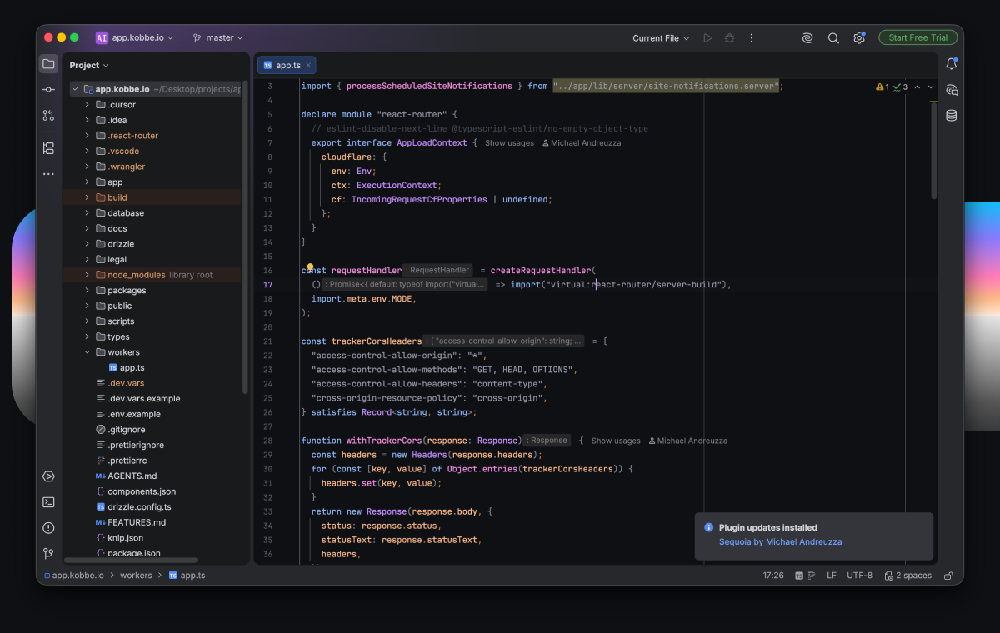
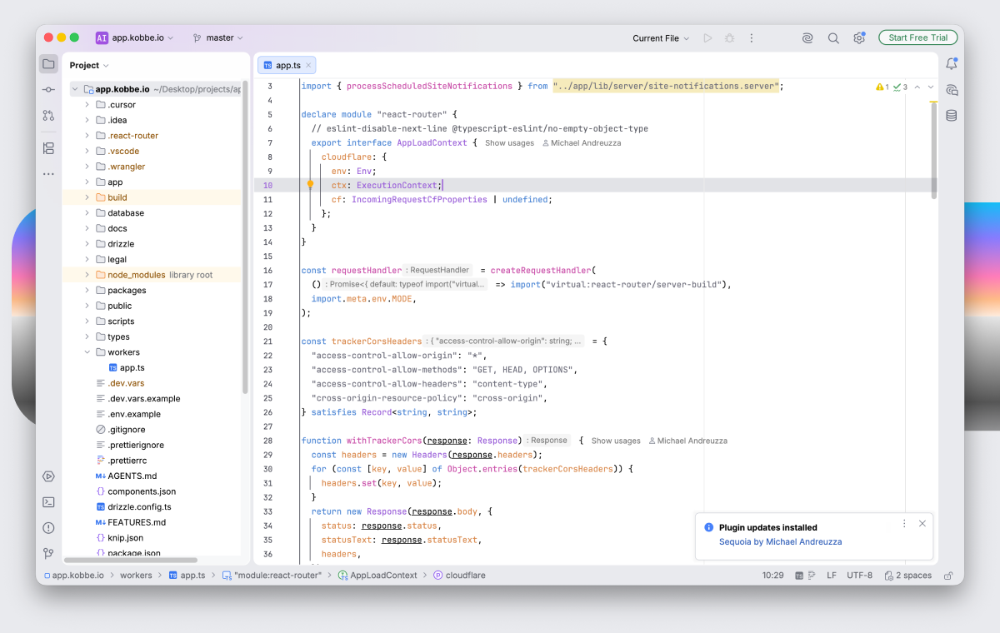
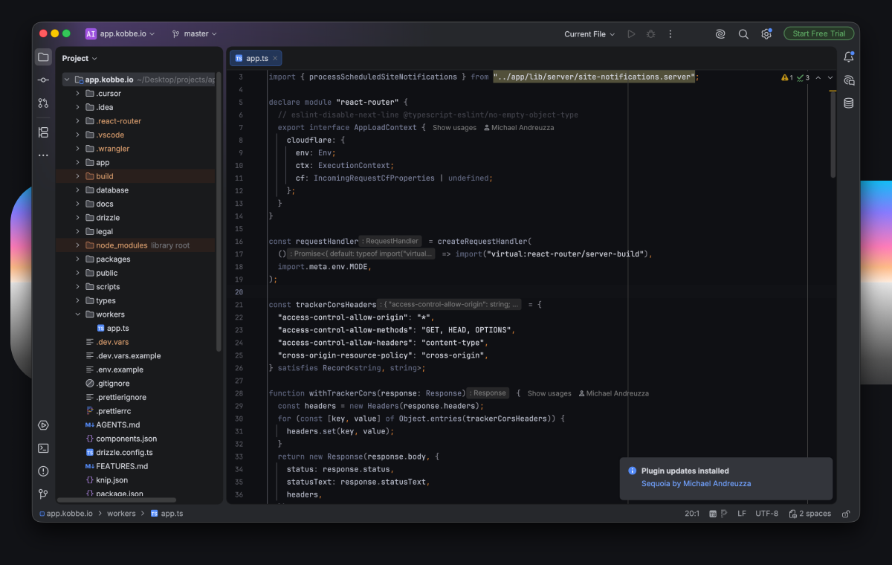
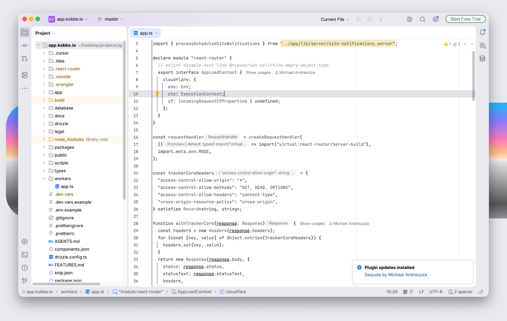
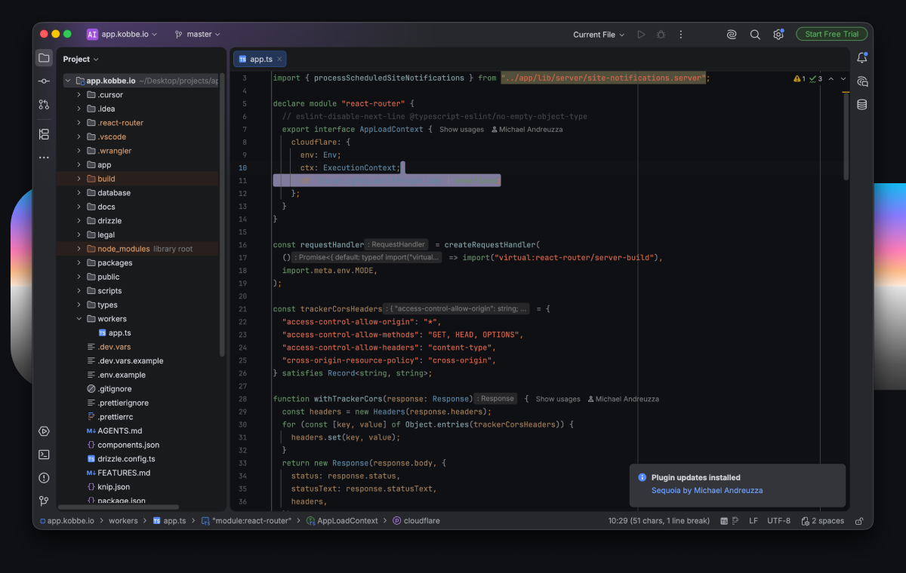
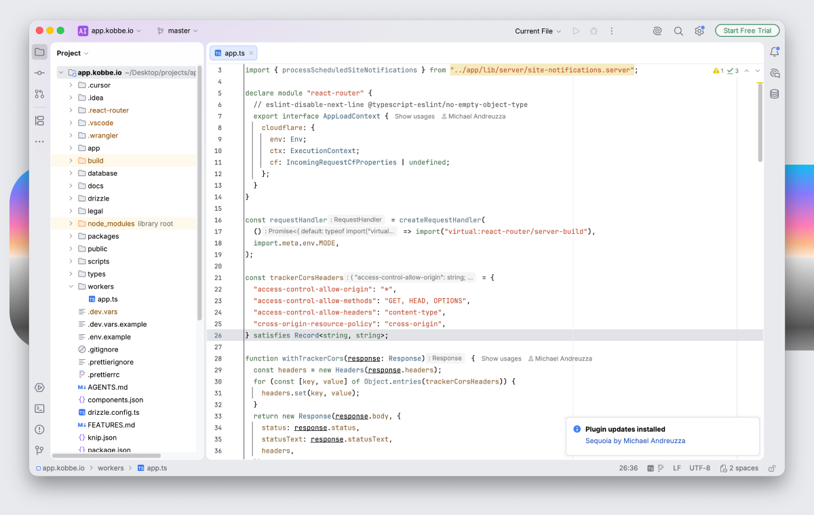

# Sequoia for JetBrains

Elegant, minimal, and clean color palette for your tools.

See other interfaces at the [official website](https://www.michaelandreuzza.com/vscode/sequoia/).

## Preview

| Sequoia Moonlight Dark | Sequoia Moonlight Light |
| --- | --- |
|  |  |

| Sequoia Monochrome Dark | Sequoia Monochrome Light |
| --- | --- |
|  |  |

| Sequoia Retro Dark | Sequoia Retro Light |
| --- | --- |
|  |  |

## Available themes

- **Moonlight Dark** — dark
- **Moonlight Light** — light
- **Monochrome Dark** — dark
- **Monochrome Light** — light
- **Retro Dark** — dark
- **Retro Light** — light

## Installation

Install from JetBrains Marketplace (see `MARKETPLACE.md`) or import `.icls` files manually (see `INSTALL.md`).

See `MARKETPLACE.md` for publishing and release steps.

## Created by

[Micheal Andreuzza](https://github.com/michael-andreuzza)
